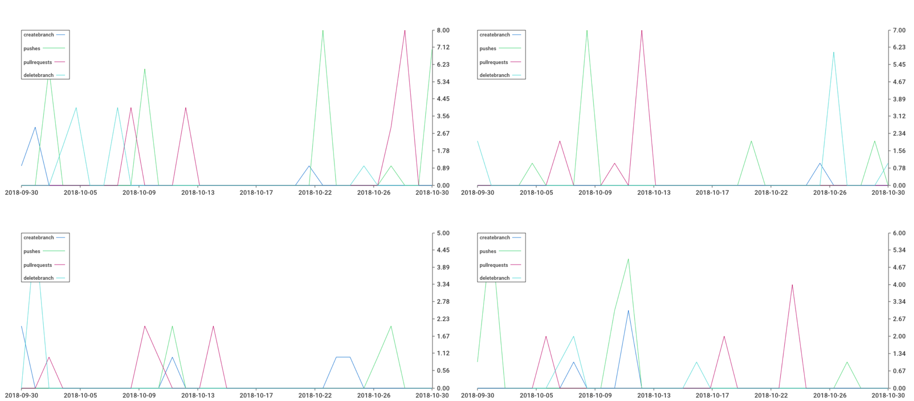

# fostering a collaborative, teamwork-driven culture using numbers 

## Introduction
github teamwork is for checking-in on a team. Are you trying to foster a collaborative culture and environment? Do you have questions about the performance of your team's team work? Every other job function is [typically] measured by stats: product, marketing, sales, customer success. Engineering teams could also be run based on numbers.

## Commands (Limited Functionality)

3 command in total.

**Pull Requests**
- `prcomments`     given a repository, github handle and date range: print out pull request comments by date, user. includes reactions (total count, :+1:, :-1:, :laughing:, :confused:, :heart: and :hooray:)
- `repoevents`     given a repository, github handle and date range: print out repo events by date, user. Includes: CreateBranch, Push, PullRequestEvents, DeleteBranch
- `teamdiscussion` given an owner/team name, github handle and date range: print out discussion events by date, user. includes reactions (total count, :+1:, :-1:, :laughing:, :confused:, :heart: and :hooray:)

## Installation

### Method 1: For Go developer

    Install dep:
    curl https://raw.githubusercontent.com/golang/dep/master/install.sh | sh

    Then get the source:
    go get -u github.com/ctava/github-teamwork

    Run dep ensure to get the depencies:
    dep ensure

### Method 2: Docker based installation

[Install Docker](https://docs.docker.com/engine/installation/#supported-platforms)

git clone this repo:

    git clone https://github.com/ctava/github-teamwork

Run the following commands:

    cd github-teamwork
    docker build -t ctava/github-teamwork .
    docker run -it ctava/github-teamwork:latest

## Execution

    This project requires a [github access token](https://github.com/settings/tokens).

    If your company uses SSO be sure to click [that option]:
    (https://help.github.com/articles/authorizing-a-personal-access-token-for-use-with-a-saml-single-sign-on-organization/)

    You can create a .env file and leverage the run.sh script:

    ./run.sh <command> <options>

    example:

    ./run.sh prcomments -R <repo_name> -U <github.com_handle> -S <start_date> -E <end_date> > <start_date>-<handle>-<command>.csv

    ./run.sh repoevents -R <repo_name> -U <github.com_handle> -S <start_date> -E <end_date> > <start_date>-<handle>-<command>.csv

    ./run.sh teamdiscussion -T <owner_name>/<team_name> -U <github.com_handle> -S <start_date> -E <end_date> > <start_date>-<handle>-<command>.csv

## Sample

